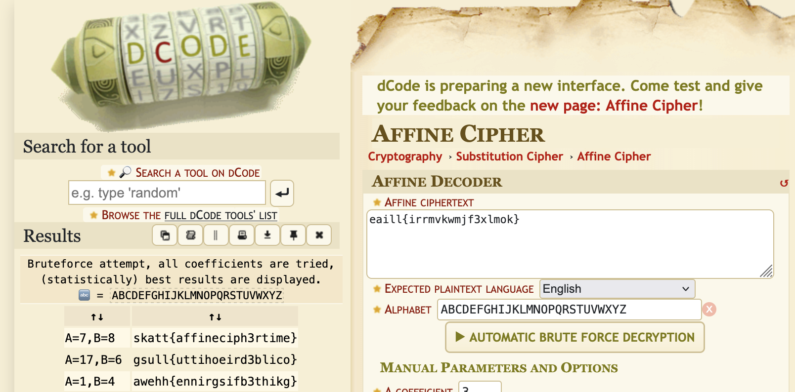

# A fine cipher

Klarer du å knekke denne?

`eaill{irrmvkwmjf3xlmok}`

# Writeup

Oppgavetittelen hinter til [Affine cipher](https://en.wikipedia.org/wiki/Affine_cipher).

[dcode](https://www.dcode.fr/affine-cipher) løser denne ganske kjapt:



# Flag

```
skatt{affineciph3rtime}
```