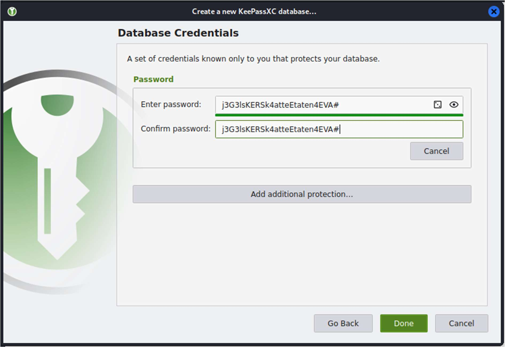

# Passordinstruks

Vedlagt ligger en passordinstruks som du kan lese. Om du finner noe av interesse kan du levere det på formatet: `skatt{noe_av_interesse}`

[⬇️ passordinstruks.pdf](./passordinstruks.pdf)

# Writeup

Her er den svarte sensur-boksen limt inn som et bilde oppå et annet bilde. Ved å hente ut alle bilder i PDFen kan vi se den usensurerte versjonen.

```
➜  Passordinstruks git:(main) binwalk -e passordinstruks.pdf
----------------------------------------------------------------------------------------------------------------------------------------------------------------------------
DECIMAL                            HEXADECIMAL                        DESCRIPTION
----------------------------------------------------------------------------------------------------------------------------------------------------------------------------
211169                             0x338E1                            JPEG image, total size: 44633 bytes
566015                             0x8A2FF                            JPEG image, total size: 67150 bytes
635839                             0x9B3BF                            JPEG image, total size: 93357 bytes
729369                             0xB2119                            JPEG image, total size: 114221 bytes
844702                             0xCE39E                            JPEG image, total size: 108465 bytes
----------------------------------------------------------------------------------------------------------------------------------------------------------------------------
[+] Extraction of jpeg data at offset 0x338E1 completed successfully
[+] Extraction of jpeg data at offset 0x8A2FF completed successfully
[+] Extraction of jpeg data at offset 0x9B3BF completed successfully
[+] Extraction of jpeg data at offset 0xB2119 completed successfully
[+] Extraction of jpeg data at offset 0xCE39E completed successfully
----------------------------------------------------------------------------------------------------------------------------------------------------------------------------

Analyzed 1 file for 85 file signatures (187 magic patterns) in 16.0 milliseconds
```

Går igjennom filene manuelt og finner riktig:



# Flag

```
skatt{j3G3lsKERSk4atteEtaten4EVA#}
```