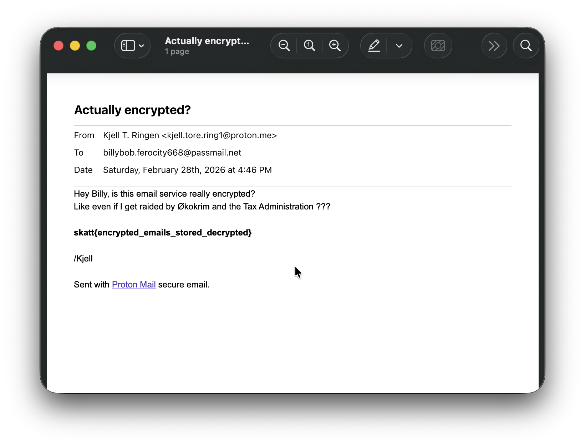

# Mac - Bad habits

Det har blitt gjennomført flere beslag hos den notoriske skattesvindleren Kjell T. Ringen. Taxman har startet analyse av Kjells Macbook med et hjemmesnekret collection verktøy, og har hentet ut delvis kopi av filsystemet og interessante artifakter.<br /><br />
Kjell ser ut til å ha en litt dårlig vane når det gjelder oppbevaring av e-postkorrespondanse. Han har i det minste ikke brukt en hel regnskog på dette, så det er da noe i hvert fall.  <br /><br />

> Alle Mac-oppgavene har samme fil som utgangspunkt: https://drive.proton.me/urls/NK9D7XR0E4#0tbSCce0ukHy <br /> Passord til zip-fil: `skattctf`

# Writeup

Unzip filen.
I følge oppgaveteksten så oppbevarer Kjell e-postkorrespondansen lokalt på maskinen. En god plass å starte å lete er da i brukerens hjemmeområde.

```bash
╰─$ ls -l Users/kjell.t.ringen/Documents
total 2528
drwx------  5 protonbat  staff     160 Mar  4 17:20 email_backup
-rwx------  1 protonbat  staff   31708 Mar  1 15:39 huracan.webp
-rwx------  1 protonbat  staff    8743 Mar  1 15:41 images-1.jpeg
-rwx------  1 protonbat  staff   11522 Mar  1 15:40 images.jpeg
-rwx------  1 protonbat  staff  356948 Mar  1 15:40 maserati.avif
-rwx------@ 1 protonbat  staff  110661 Mar  1 15:42 maxresdefault.jpg
-rwx------@ 1 protonbat  staff   21360 Mar  1 15:42 pexels-photo-1108099.webp
-rwx------@ 1 protonbat  staff   12498 Mar  1 15:42 tax-man-running-after-homeless-260nw-1073242319.jpg.webp
-rwx------  1 protonbat  staff  706688 Mar  1 15:45 Untitled.png
```

Mappen `email_backup` ser jo veldig interessant ut her.

```bash
╰─$ ls -l Users/kjell.t.ringen/Documents/email_backup
total 728
-rwx------@ 1 protonbat  staff  110861 Mar  1 15:55 Actually encrypted?.pdf
-rwx------@ 1 protonbat  staff  109884 Mar  1 15:35 kontaktinfomation.pdf
-rwx------@ 1 protonbat  staff  131911 Mar  4 17:20 New computer, need some help.pdf
```
Om man åpner den første PDF-filen får man flagget:



# Flag

```
skatt{encrypted_emails_stored_decrypted}
```