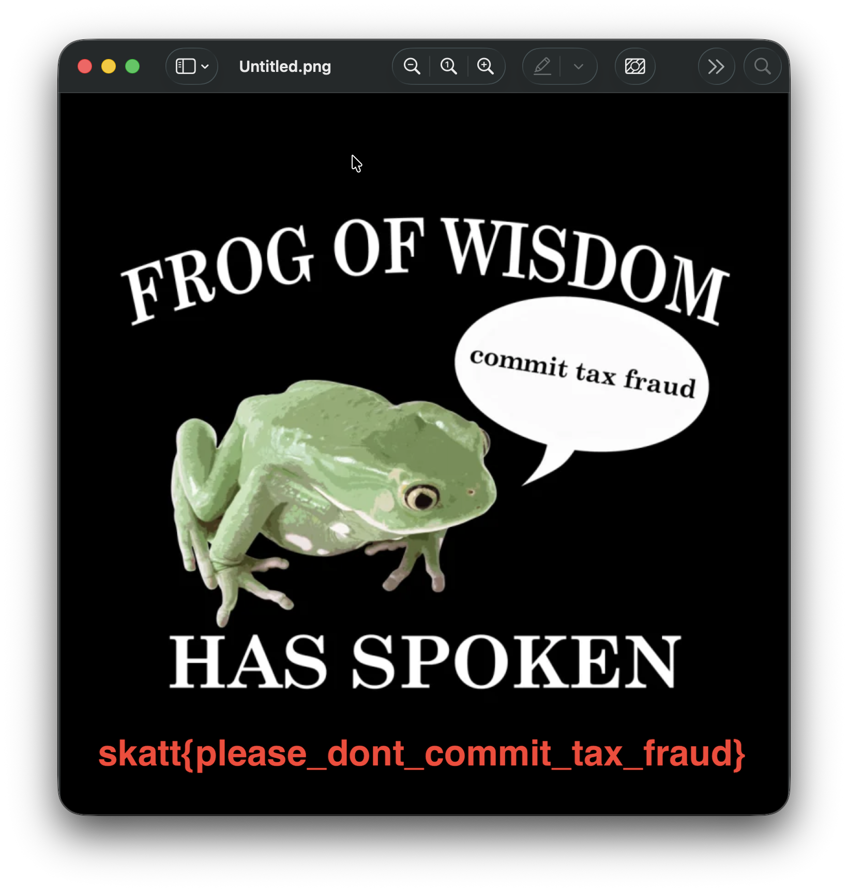

# Mac - Bakgrunnsbilde

Det har blitt gjennomført flere beslag hos den notoriske skattesvindleren Kjell T. Ringen. Taxman har startet analyse av Kjells Macbook med et hjemmesnekret collection verktøy, og har hentet ut delvis kopi av filsystemet og interessante artifakter.<br /><br />
Kjells bakgrunnsbilde understreker hvor han står når det gleder skattesvindel. Bildet er også lagret til disk. Finner du det? <br /><br />

> Alle Mac-oppgavene har samme fil som utgangspunkt: https://drive.proton.me/urls/NK9D7XR0E4#0tbSCce0ukHy <br /> Passord til zip-fil: `skattctf`

# Writeup

Informasjon om hvilket bakgrunnsbilde Kjell bruker er lagret her:
```
Users/kjell.t.ringen/Library/Application Support/com.apple.wallpaper/Store/Index.plist
```
Plist-filer kan på Mac leses ved å kjøre `plutil -p "Users/kjell.t.ringen/Library/Application Support/com.apple.wallpaper/Store/Index.plist"`
```
...
  "SystemDefault" => {
    "Desktop" => {
      "Content" => {
        "Choices" => [
          0 => {
            "Configuration" => {length = 226, bytes = 0x62706c6973743030d2123c5f10f ... 0000000b5}
            "Files" => [
              0 => {
                "relative" => "file:///Users/kjell.t.ringen/Documents/Untitled.png"
              }
            ]
            "Provider" => "com.apple.wallpaper.choice.image"
...
```
Men man kan også bruke strings for å få ut det man trenger: `strings "Users/kjell.t.ringen/Library/Application Support/com.apple.wallpaper/Store/Index.plist"`
```
...
 com.apple.wallpaper.choice.image
Xrelative_
3file:///Users/kjell.t.ringen/Documents/Untitled.pngO
bplist00
backgroundColorYplacement
ZcomponentsZcolorSpace
...
```
Åpner man filen som wallpaper-configen refererer til ser man flagget.


# Flag

```
skatt{please_dont_commit_tax_fraud}
```