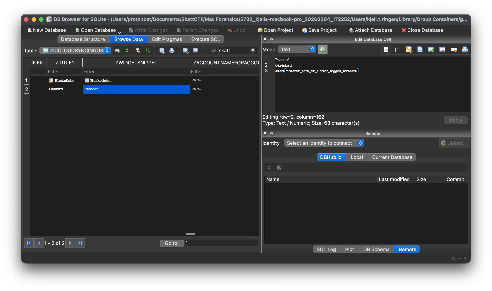

# Mac - Passord

Det har blitt gjennomført flere beslag hos den notoriske skattesvindleren Kjell T. Ringen. Taxman har startet analyse av Kjells Macbook med et hjemmesnekret collection verktøy, og har hentet ut delvis kopi av filsystemet og interessante artifakter.<br /><br />
Kjell har på et tidspunkt lagret passordet sitt på maskinen, men slettet det når han skjønte det kanskje ikke var så lurt. Finner du passordet hans? <br /><br />

> Alle Mac-oppgavene har samme fil som utgangspunkt: https://drive.proton.me/urls/NK9D7XR0E4#0tbSCce0ukHy <br /> Passord til zip-fil: `skattctf`

# Writeup

Kjell hadde lagret passordet sitt et notat i `Notes`-appen. Googler man hvor man kan finne notes på maskinen finner man følgende fil+path:
```
~/Library/Group Containers/group.com.apple.notes/NoteStore.sqlite
```
I tabellen `ZICCLOUDSYNCINGOBJECT` finner vi et slettet notat. Selve notatet kan vi se i kolonnen `SWIDGETSNIPPET`. 
```
Passord
0kriskatt
skatt{notater_som_er_slettet_logges_fortsatt}
```
Passordet hans er `0kriskatt`.



# Flag

```
skatt{notater_som_er_slettet_logges_fortsatt}
```