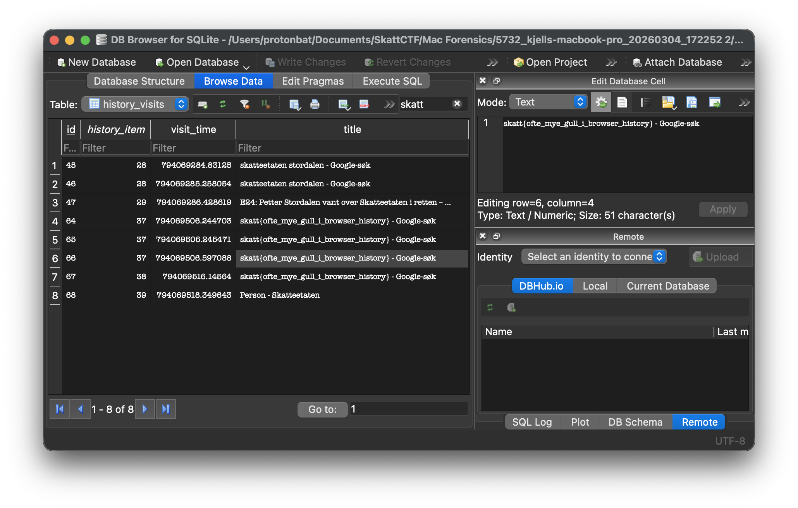

# Mac - Surfing bird

Det har blitt gjennomført flere beslag hos den notoriske skattesvindleren Kjell T. Ringen. Taxman har startet analyse av Kjells Macbook med et hjemmesnekret collection verktøy, og har hentet ut delvis kopi av filsystemet og interessante artifakter.<br /><br />
Kjell har surfet en del på nett som underbygger vår mistanke om hans forhold til skatt. Finner du et flagg i denne retningen?<br /><br />

> Alle Mac-oppgavene har samme fil som utgangspunkt: https://drive.proton.me/urls/NK9D7XR0E4#0tbSCce0ukHy <br /> Passord til zip-fil: `skattctf`

# Writeup

Oppgavenavn og oppgavetekst hinter til surfehistorikk. <br /><br />
Hvis man googler ettrer hvor Safari logger browser-historikken, finner man fort at det logges i `~/Library/Safari/History.db`.<br /><br />
Disse database-filene kan åpnes med for eksempel [`DB Browser for SQLite`](https://sqlitebrowser.org/). 
I tabellen `history_visits` finner vi ut at Kjell har googlet etter `skatt{ofte_mye_gull_i_browser_history}`



# Flag

```
skatt{ofte_mye_gull_i_browser_history}
```