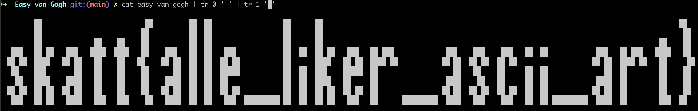

# Easy van Gogh

[⬇️ easy_van_gogh](./easy_van_gogh)

# Writeup

Filen ser ut som binære data, men om du erstatter `0` med ` ` og `1` med en blokk, og skalerer terminalen riktig kan du se et flagg:



# Flag

```
skatt{alle_liker_ascii_art}
```