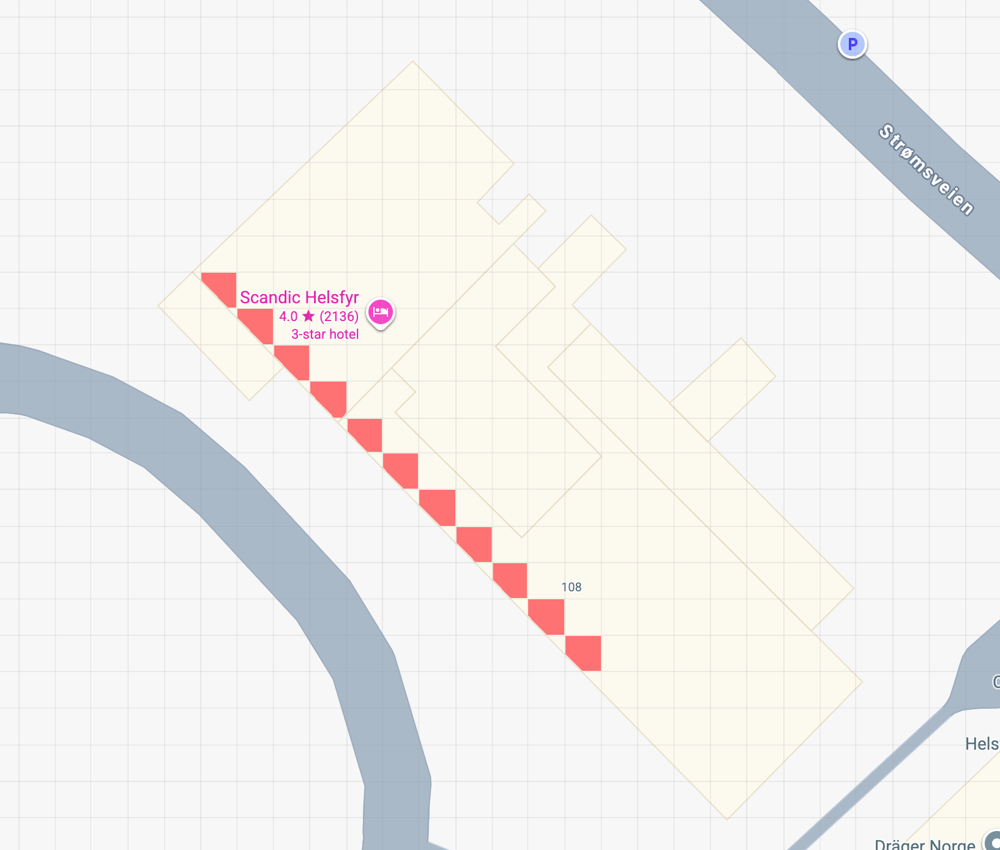

# OSINT 1

Skatteetaten har kontorer over hele landet, men dette er kanskje det mest kjente. Hvor står fotografen?

Finn lokasjon og svar med tre engelske ord, punktum mellom ordene. Eksempel: `skatt{word1.word2.word3}`.

[⬇️ osint_1.jpg](./osint_1.jpg)

# Writeup

"word1.word2.word3" hinter [what3words](https://what3words.com/), en geokodingstjeneste som deler verden inn i 3x3 meter store ruter og gir hver rute en unik kombinasjon av tre ord. Her er det spesifisert at vi bruker den engelske varianten.

Bildet viser Skatteetatens lokaler på Helsfyr i Oslo tatt fra Scandic Helsfyr.

Alle rutene merket i rødt var godtatte flagg.



# Flag

```
skatt{blanked.ranted.then}
skatt{include.hips.revived}
skatt{animated.bleach.slurs}
skatt{deduct.modern.hook}
skatt{prompting.lost.watching}
skatt{bespoke.tries.tractor}
skatt{sectors.island.candle}
skatt{eating.dodging.vocally}
skatt{activism.petition.thudded}
skatt{campers.flock.begun}
skatt{revived.total.concerts}
```
