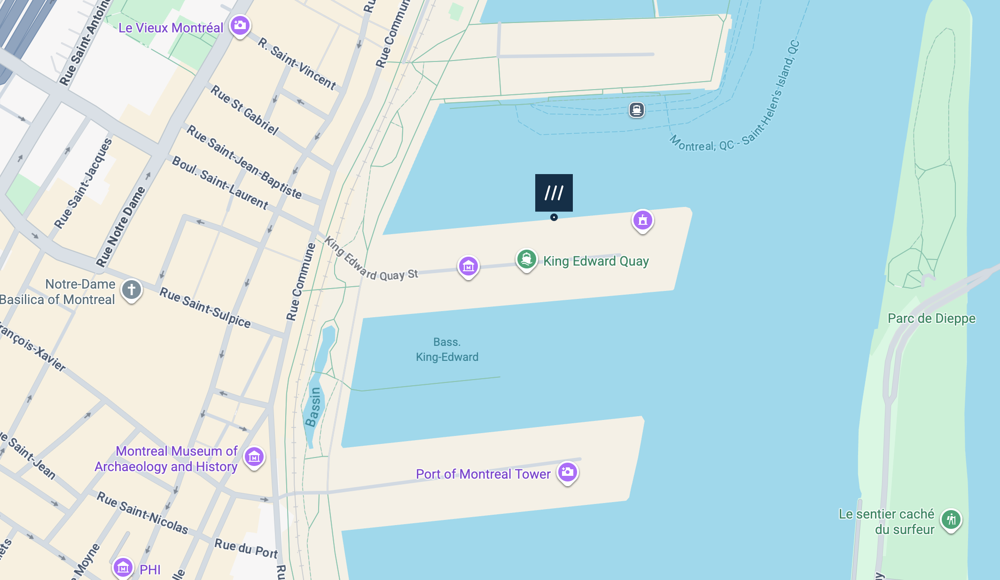
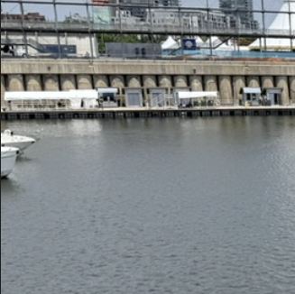
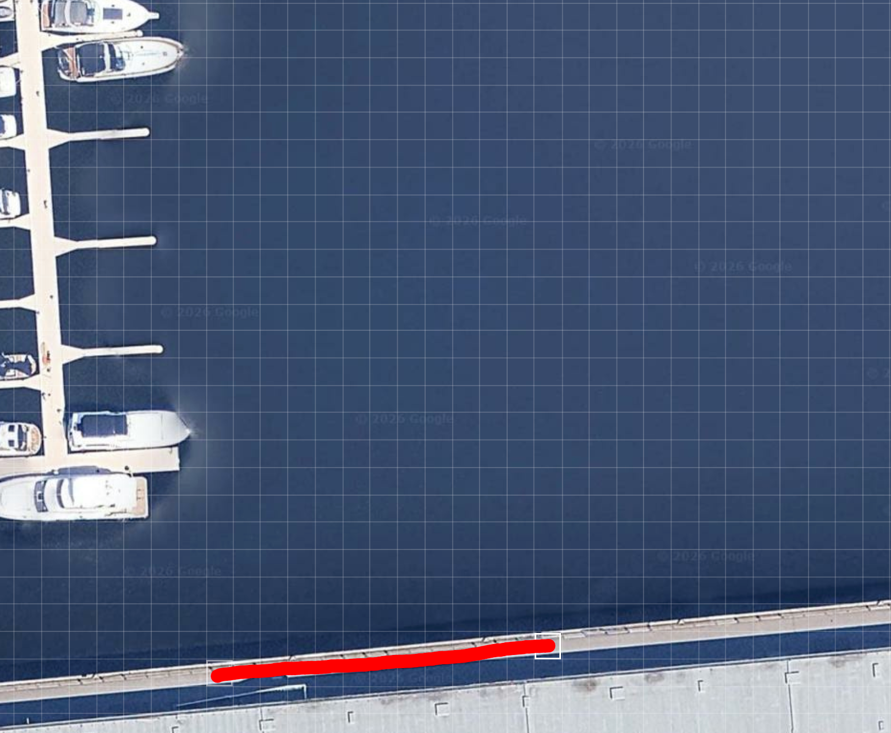

# OSINT 2

Borgeren har stukket av fra skatten, og det er opp til deg å finne ut hvor han er. Det eneste du har å gå på er at han har lagt ut et bilde.

Finn lokasjon og svar med tre engelske ord, punktum mellom ordene. Eksempel: `skatt{word1.word2.word3}`.

[⬇️ osint_2.jpg](./osint_2.jpg)

# Writeup

Som med OSINT 1 er det hintet til at vi skal bruke [what3words](https://what3words.com/).

Bilde tatt i Montreal. Mange fant fort hvilken kai det var snakk om:



Men for å finne nøyaktig hvor på kaien bildet er tatt fra er båtene helt til venstre i bildet viktige å få med seg:



Fjorten ruter langs den røde streken var godkjente flagg:



# Flag

```
skatt{crystals.kipper.decays}
skatt{costumes.jeep.figs}
skatt{brief.gentle.sliding}
skatt{rocky.deflect.dragon}
skatt{wicket.pizzas.stutter}
skatt{graver.banana.invented}
skatt{supporter.fronted.grocers}
skatt{soak.music.detection}
skatt{dorm.bronzes.duke}
skatt{emails.drops.easels}
skatt{third.snips.venues}
skatt{expect.newly.unlucky}
skatt{goggle.burst.knitted}
skatt{clearly.minds.deposits}
```