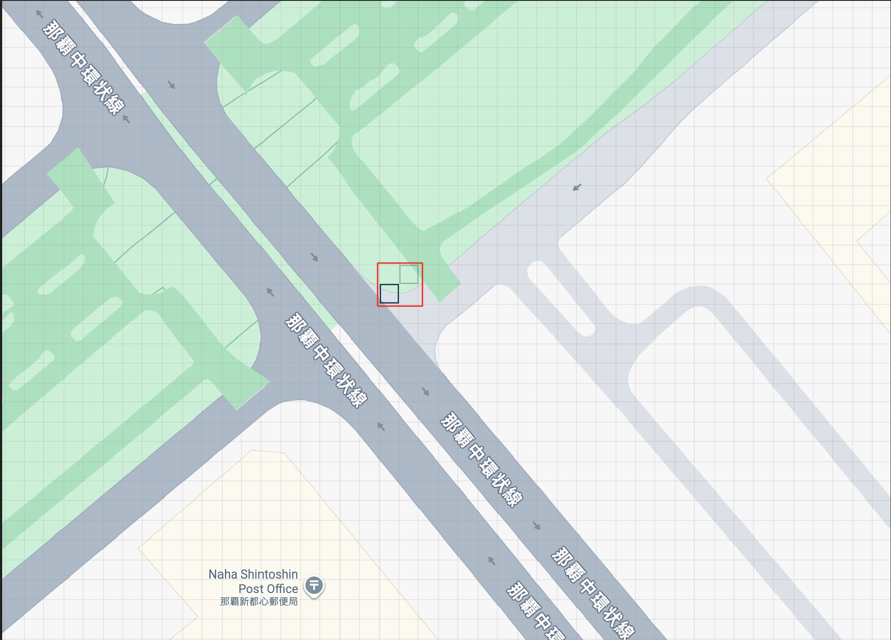

# OSINT 3

Jeg kom over dette skiltet som ligner uhyret mye på Skatteetatens gamle logo.

Finn ut _hvilke 3 ord_ skiltet står på. <br/><br/>
Svar med tre engelske ord, punktum mellom ordene. Eksempel: `skatt{word1.word2.word3}`.

[⬇️ osint_3.jpg](./osint_3.jpg)

# Writeup

Som med OSINT 1 er det hintet til at vi skal bruke [what3words](https://what3words.com/).

Her var det viktig å lese oppgaven. Det spørres om hvor skiltet står, ikke hvor fotografen er.

Fire ruter var gyldige her:


# Flag

```
skatt{soothing.steams.respect}
skatt{first.decrease.wonderfully}
skatt{scanner.bill.helm}
skatt{evaded.textiles.jump}
```