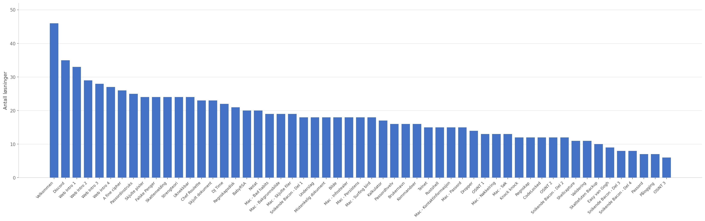
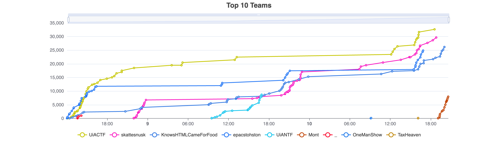
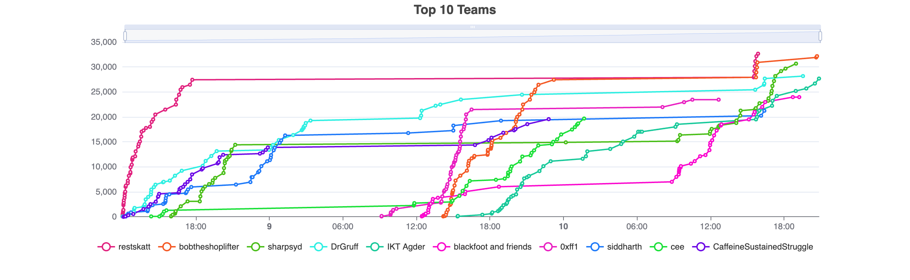

# SkattCTF 2026

Skatteetaten arrangerte CTF i forbindelse med Sikkerhetsanalytikerkonferansen 2026 på UiA Campus Grimstad den 11. mars 2026.

# Statistikk

- 82 brukere
- 48 lag
- 52 oppgaver
- 996 korrekte innsendinger
- 1420 feil innsendinger

## Løsningstall

## On-site

Spillere som deltar på konferansen.

## Online

Spillere som ikke deltar på konferansen men deltok på CTF-en online.

# Oppgaver

## Intro

- Velkommen (Flagg i beskrivelsen, kun info)
- Discord (Flagg i beskrivelsen, kun info)
- [Chef Roulette](Intro/Chef%20Roulette/README.md)

## Mac

- [Mac - Bad habits](Mac/Mac%20-%20Bad%20habits/README.md)
- [Mac - Bakgrunnsbilde](Mac/Mac%20-%20Bakgrunnsbilde/README.md)
- [Mac - Skjulte filer](Mac/Mac%20-%20Skjulte%20filer/README.md)
- [Mac - Surfing bird](Mac/Mac%20-%20Surfing%20bird/README.md)
- [Mac - Infostealer](Mac/Mac%20-%20Infostealer/README.md)
- [Mac - Persistens](Mac/Mac%20-%20Persistens/README.md)
- [Mac - Passord](Mac/Mac%20-%20Passord/README.md)
- [Mac - Søk](Mac/Mac%20-%20Søk/README.md)
- [Mac - Kontaktinformasjon](Mac/Mac%20-%20Kontaktinformasjon/README.md)
- [Mac - Nøkkelring](Mac/Mac%20-%20Nøkkelring/README.md)

## Web

- [Web Intro 1](Web/Web%20Intro%201/README.md)
- [Web Intro 2](Web/Web%20Intro%202/README.md)
- [Web Intro 3](Web/Web%20Intro%203/README.md)
- [Web Intro 4](Web/Web%20Intro%204/README.md)
- [Snikende Bacon - Del 1](Web/Snikende%20Bacon%20-%20Del%201/README.md)
- [Snikende Bacon - Del 2](Web/Snikende%20Bacon%20-%20Del%202/README.md)
- [Snikende Bacon - Del 3](Web/Snikende%20Bacon%20-%20Del%203/README.md)
- [Snikende Bacon - Del 4](Web/Snikende%20Bacon%20-%20Del%204/README.md)
- [Pålogging](Web/Pålogging/README.md)
- [Validering](Web/Validering/README.md)

## Crypto

- [A fine cipher](Crypto/A%20fine%20cipher/README.md)
- [Uknekkbar](Crypto/Uknekkbar/README.md)
- [Passordhvelv](Crypto/Passordhvelv/README.md)
- [BabyRSA](Crypto/BabyRSA/README.md)

## Forensics

- [Passordinstruks](Forensics/Passordinstruks/README.md)
- [Falske Penger](Forensics/Falske%20Penger/README.md)
- [Mistenkelig dokument](Forensics/Mistenkelig%20dokument/README.md)
- [Knock knock](Forensics/Knock%20knock/README.md)
- [Shellcapture](Forensics/Shellcapture/README.md)

## Misc

- [Skattemelding](Misc/Skattemelding/README.md)
- [Easy van Gogh](Misc/Easy%20van%20Gogh/README.md)
- [Regnskapsdisk](Misc/Regnskapsdisk/README.md)
- [Underslag](Misc/Underslag/README.md)
- [Kalkulator](Misc/Kalkulator/README.md)
- [Skattefuten Backup](Misc/Skattefuten%20Backup/README.md)
- [Regnskap](Misc/Regnskap/README.md)

## rev

- [Strengteori](rev/Strengteori/README.md)
- [Dropper](rev/Dropper/README.md)
- [CodeLocked](rev/CodeLocked/README.md)

## Minneanalyse

- [Notat](Minneanalyse/Notat/README.md)
- [Bilde](Minneanalyse/Bilde/README.md)
- [Kommandoer](Minneanalyse/Kommandoer/README.md)
- [Brukernavn](Minneanalyse/Brukernavn/README.md)
- [Passord](Minneanalyse/Passord/README.md)

## Stego

- [Skjulte pixler](Stego/Skjulte%20pixler/README.md)
- [Skjult dokument](Stego/Skjult%20dokument/README.md)
- [DJ Time](Stego/DJ%20Time/README.md)

## OSINT

- [OSINT 1](OSINT/OSINT%201/README.md)
- [OSINT 2](OSINT/OSINT%202/README.md)
- [OSINT 3](OSINT/OSINT%203/README.md)

## pwn

- [Telnet](pwn/Telnet/README.md)
- [Rustshell](pwn/Rustshell/README.md)

