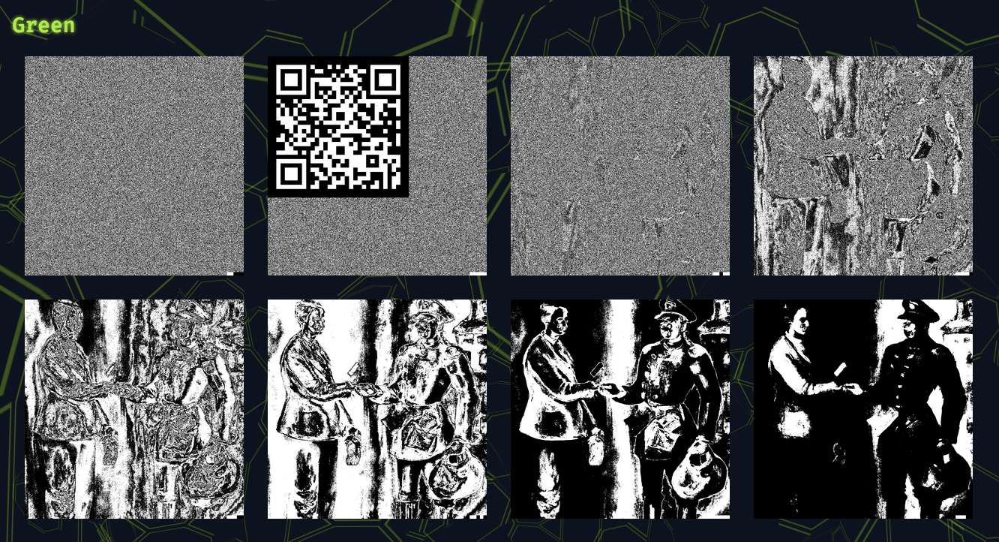
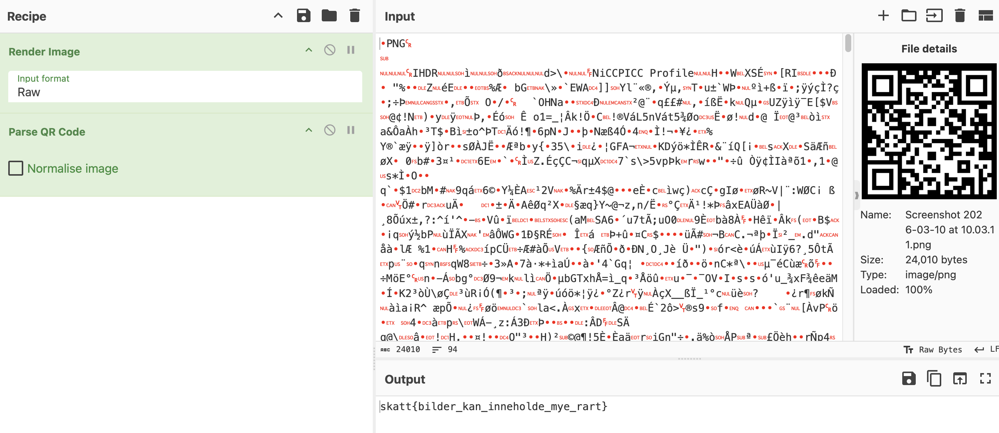

# Skjulte pixler

Steganografi er kunsten å skjule informasjon innenfor et annet medium, for eksempel et bilde eller en tekstfil. Lykke til!

[⬇️ taxcollector.png](./taxcollector.png)

# Writeup

Den vedlagte PNGen har en QR-kode skjult i det grønne bitplanet. [Aperi'Solve](https://www.aperisolve.com) henter ut og viser alle bildeplan på en oversiktelig måte:



QR-koden kan du lese av med mobiltelefonen, eller bruke f.eks. [CyberChef](https://gchq.github.io/CyberChef/):



# Flag

```
skatt{bilder_kan_inneholde_mye_rart}
```