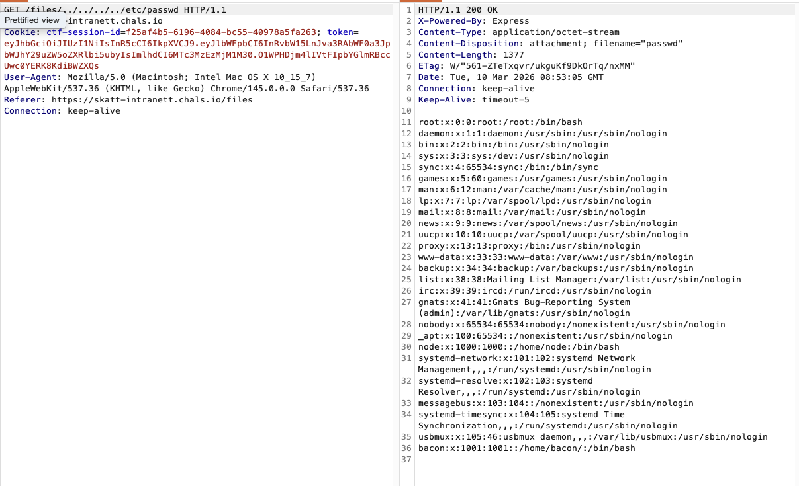

# Snikende Bacon - Del 2

Bra Jonas! Eller skal jeg kalle deg Tommy? 😉

Målet er innenfor rekkevidde!

Du fant en sårbarhet og fikk tilgang til filer du ikke skulle se, imponerende arbeid!

XSS skrives på rapporten!

Har du kanskje fått tilgang til noe mer som kan lede deg videre? 🥓

[🔗 https://skatt-intranett.chals.io/](https://skatt-intranett.chals.io/)

# Writeup

Fra filen vi fant får vi følgende:

```
Fra: Tommy
Emne: Ny løsning for K-disk og loggtilgang

Hei alle!

Som jeg har forstått syntes dere det er vanskelig å bruke SSH for å lese dokumenter.
Derfor har jeg nå flyttet alle dokumentene fra /home/bacon/dokumenter til /dokumenter.
Deretter satt jeg opp en K: disk som alle får på sine klientmaskiner som går direkte til denne.

NB: Her skal kun interne dokumenter.

Jeg har også flyttet lageroversikten til en ny filtjeneste på intranettet. 
Her kan dere laste opp og dele filer med alle ansatte som har den tilgangen.

Jeg holder på å utvikle logging på intranettet, 
har skrevet et dokument på hvordan man skrur dette på for testing på K-disken.

Magnus har også en viktig beskjed, dere må slutte å skrive passord i terminalen,
dette snakket vi om på teammøtet sist uke også og han fant igjen et passord der i dag.

Han har ryddet i historiefilen men dere må være forsiktig!

Ha en ellers sprø arbeidsdag!

- Tommy Røkt
```

Her ser man en full sti til hvor dokumentene ligger, samt en hjemmemappe. Det hintes også om at man ikke skal skrive passord i terminalen, og at det er ryddet i historiefilen. Dette kan tyde på at det er en sårbarhet i filleseren som gjør at man kanskje kan få tak i disse filene. Sårbarheten er en Local File Inclusion (LFI) i filsiden.

Ved å kjøre en standard LFI payload som `http://skatt-intranett.chals.io/files/../../../../etc/passwd` så får



Så ved å sjekke `/home/bacon/.bash_history` ser man en del filer som blir nevnt, blant annet `logg.txt` i `/dokumenter`. Sjekker man den filen så får man flagget og hint til neste oppgave.

# Flag

```
skatt{d0t_d0t_sl4sh_t0_v1ct0ry}
```