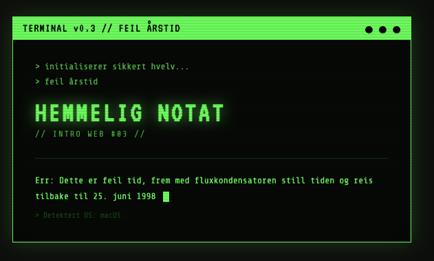
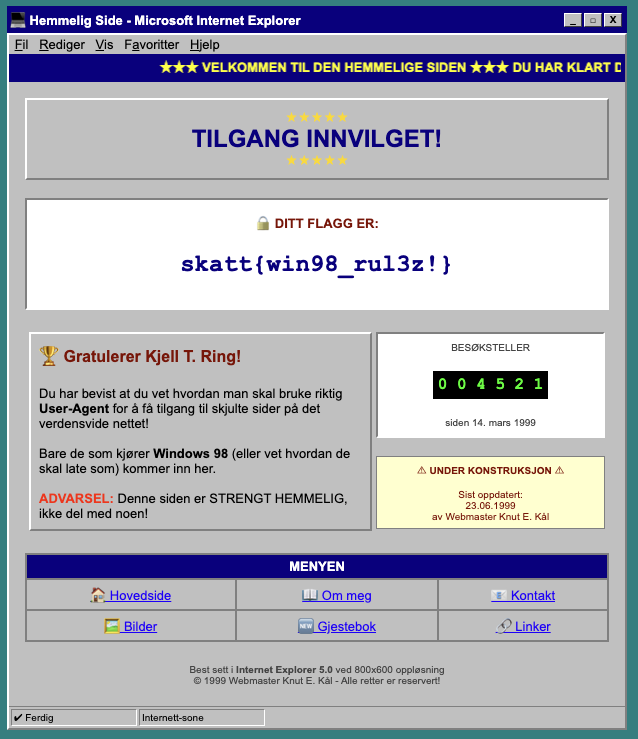

# Web Intro 3

En tur ned minnestien

[🔗 https://skatt-webintro.chals.io/intro3](https://skatt-webintro.chals.io/intro3)

# Writeup

Her får vi opp en feilmelding med en gang



Denne hinter om at man må tidsreise, hva skjedde 25. Juni 1998? Windows 98 ble lansert! Hvilken nettleser brukte man da?

Ved å endre user agent til en som var vanlig i 1998, så burde man kunne få tilgang til flagget. Et annet hint er om man ser i kildekoden på siden så ser man den faktiske sjekken som bestemmer hvilket OS man er på, her ser man at user agenten må innholde enten `Windows 98` eller `Win98`.

I chrome kan man åpne devtools, trykke på de tre prikkene i høyre hjørne, gå til "More tools" og så "Network conditions". Hukk av `Use browser default` og skriv inn `Windows 98` i feltet under. Last så inn siden på nytt og flagget kommer opp!




# Flag

```
skatt{win98_rul3z!}
```