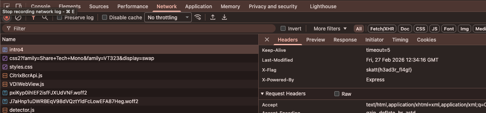

# Web Intro 4

Men hvor er det blitt av flagget nå?

[🔗 https://skatt-webintro.chals.io/intro4](https://skatt-webintro.chals.io/intro4)

# Writeup

Her er det bare å titte i Network tabben i devtools og se etter noe som ser ut som flagget. I requesten kommer flagget som en header `X-Flag`!



# Flag

```
skatt{h3ad3r_fl4g!}
```